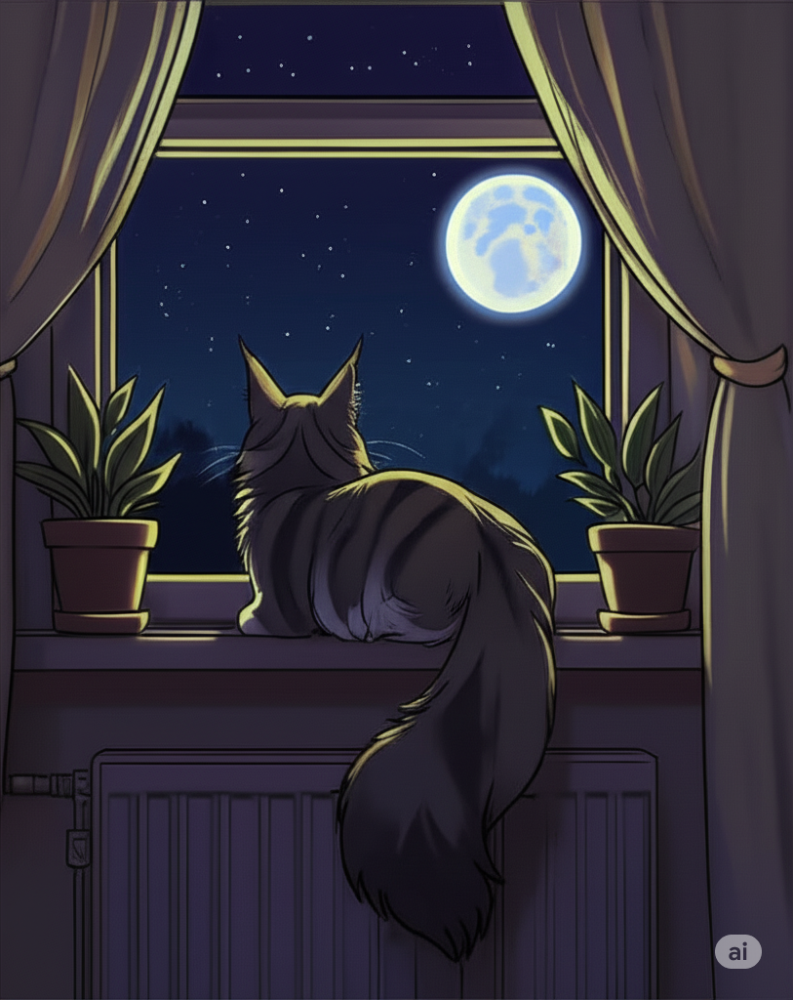

# smollm2-mentalhealth-360m
Repository for the smollm2-mentalhealth-360m models

# How To Get Started
## V2 versions:
For use with transformers 🤗

<a href="https://huggingface.co/dzur658/smollm2-mentalhealth-360m-V2">smollm2-mentalhealth-360m-v2 safetensors</a>

For use with Ollama, LMstudio, etc

<a href="https://huggingface.co/dzur658/smollm2-mentalhealth-360m-v2-gguf">smollm2-mentalhealth-360m-v2 GGUF</a>

## Original (V1)
*Note these are prototype models that should be used for research/testing as they were only trained on 60 steps of the dataset!*

For use with transformers 🤗

<a href="https://huggingface.co/dzur658/smollm2-mentalhealth-360m">smollm2-mentalhealth-360m (original) safetensors</a>

For use with Ollama, LMstudio, etc

<a href="https://huggingface.co/dzur658/smollm2-mentalhealth-360m-gguf">smollm2-mentalhealth-360m (original) GGUF</a>

# How We Got Here 🤔
This is my first batch of models uploaded to the Hugging Face Hub! I decided that I wanted to try and fine tune a small model that would fit on my 3050 TI laptop GPU (4gb of VRAM)
and selected smollm2-360m as the base model (that barely fit on the card for finetuning!). This was a full fine tune that was done on this model based off my knowledge of the
HF transformers library, extra information found from guides, and some help from Gemini 2.5 pro. 😊 The first version of the model only trained for 60 steps and as a result performed quite
poorly so I immediately began work on v2 which trained for 3 whole epochs and achieves better conversationality. The primary purpose of this project was to prove viability of full fine tuning
with very restrictive VRAM and mental health was chosen as the topic for the <a href="https://huggingface.co/datasets/Amod/mental_health_counseling_conversations">training dataset</a> due to it's inherit subjectivity in comparison to more discrete subjects
(programming, querying, etc). More information is available on the <a href="https://huggingface.co/dzur658/smollm2-mentalhealth-360m-V2">Hugging Face repos 🤗</a>, the primary purpose of this repository is to host scripts used to create the model for
the community.

# Before Getting Started
Using your favorite python env manager install the required dependencies from requirements.txt

`pip sync -r requirements.txt`

All scripts should be able to run now

# Explanation of Scripts
- **smollm_finetuning.py:** finetuning script for the **original** model
- **smollm_finetuningv2.py:** finetuning script for the **v2** model
- **testing_chat.py:** script used for testing the model
- **push_to_hub.py:** script used to push the model files to the hub

# Credit
If you use this model please credit me by name (Alex Dzurec) or by my HuggingFace 🤗 username (dzur658)
